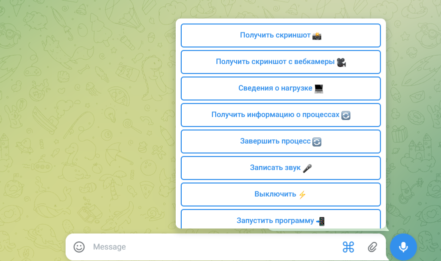

# TgRemoteControl - Удаленное управление компьютером через Telegram

## Основные возможности:

- **Удаленное управление:**  
  Управляйте вашим компьютером с помощью команд в Telegram. Вы можете запускать приложения, управлять файлами, процессами и выполнять другие команды на компьютере.
  
- **Мониторинг состояния:**  
  Получайте актуальную информацию о состоянии системы, включая загрузку процессора, использование памяти, сетевые соединения и другие параметры, которые позволяют следить за состоянием вашего компьютера.
  
- **Безопасность:**  
  Все соединения между вашим компьютером и Telegram-ботом защищены с использованием Telegram API. Для обеспечения безопасности реализованы механизмы авторизации и аутентификации пользователя.
  
- **Пользовательский интерфейс:**  
  Простота использования благодаря интуитивно понятному интерфейсу в Telegram. Даже пользователи с минимальными техническими знаниями смогут с легкостью управлять ботом.

## Преимущества:

- **Удобство использования:**  
  Благодаря Telegram пользователи могут управлять своим компьютером через мессенджер, который всегда под рукой на мобильных устройствах.
  
- **Гибкость:**  
  Легкость настройки и расширения бота под индивидуальные нужды пользователя. Вы можете добавлять новые функции и интегрировать с другими сервисами.

